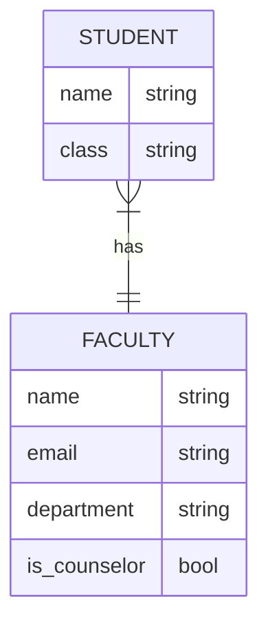
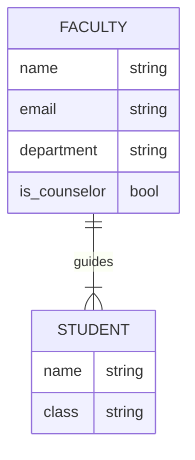
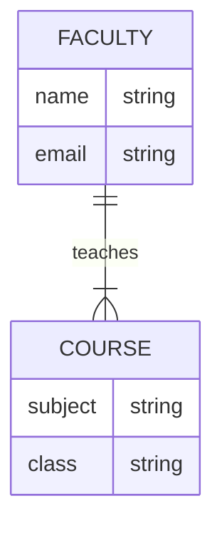
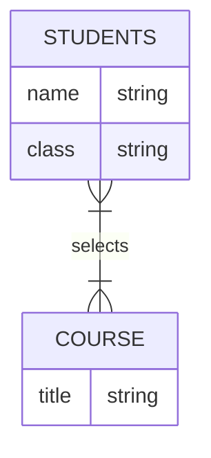

# Cardinality, Wait wtf? 🤔

Let's talk data modelling. Not entirely, but a weird jargon I have come across today while learning about system designing. See, this is one of the term everyone knows, without knowing the "name" for it. Everyone knows data normalization, does know cardinality already. Let me try to explain it with a real life example. 

## Definition which no one interested in 🫢
Cardinality represents the number of times an entity of an entity set participates in a relationship set. Or we can say that the cardinality of a relationship is the number of tuples (rows) in a relationship. It is a fundamental concept that helps define how data in different tables connect and how many unique entries exist in a particular column.😵‍💫🤕

## Definition which is relatable a wee little 🔬
Let's say there are several entities in your database to store student details, which are necessary to be attached to the student entity. So what kind of relationship is being established by the student and the other entity is what is called as Cardinality. 

Wait, I know, I can hear you cursing me 🔇 ! Will dive into examples for explaining the types. 

## The example! 
Damn, it is really an exhaustive thought process to come up with a commonly known real life example which everyone who deals with databases or software designing knows. 
> Mr. Hulk as a University Student! 🎉

We shall consider my friend, Mr. Hulk 🐶, joining the university. Let's see how he is establishing relationships with his other entities he will face at the university. 

#### Here is the picture of Mr.Hulk, no one asked for!
<figure markdown="span">
    { width="300" }
<figcaption>Smart, isn't he? 💫 </figcaption>
</figure>

### 1:1 - He got only one guidance counselor! 

The university is a weird to stay sane and how to be a good boy 🐶 as always? The university assigns him a guidance counselor. He can visit the counselor and get advises for how to get a part-time job, how to choose majors, internships available in campus etcetera. So for a student there is only one counselor, simple. 

**Mr. Hulk 🐕 :** _Psst, I will sneak in to explain the theory which this guy couldn't. In short, I have a 1:1 cardinal relationship with my counselor, and every student here. See the relation below._

### N:1 - But his counselor have many students to guide

There are only so many good faculties the university can afford. So they have to assign many number of students for every faculty. So, what our good boy expected as the counselor will be available always is not possible, he has to get an appointment for getting advice (belly rubs also 😉). 

**Mr. Hulk 🐕 :** Did you notice a fork attached to student table in previous ER diagram, which means the counselor will have minimum one or more students under his/her guidance. Let's see it reverse this time for understanding better.
> My counselor, Mr. Edwards ✂️ ✋ gives weird scratches though! 

### 1: N - His professors teach more than one courses

He was amazed that, his counselor Mr. Edwards, specialized in chemistry, is teaching many courses, Chemistry 101, Biochemistry 101, Organic Chemistry and some courses he couldn't pronounce with treats in his mouth 🍗

**Mr. Hulk 🐕 :** So one professor might be teaching more than one course, which is one to N, the obvious reversal of previous ER diagram. 

### M:N, Have to pick multiple majors

Mr. Hulk has chosen this university, because he has to specialize in more than one majors to graduate. He along with his classmates are selecting more than one major specialty courses to learn and 😢 later. 

**Mr. Hulk 🐕 :** Many students, many courses. But one can not select all the majors available at the university and every student will not select only one course.

## Summary
**Mr. Hulk 🐕 :** This example could have diverted you because of my cuteness. So I will give another set of examples with related to eCommerce platform. 

- 1:1 - Customer 👨 to Shopping cart 🛒
- 1: N - Customer 👨 to Orders 📦
- N: 1 - Reviews ⭐ to a product 🎁
- M: N - Products 🎁 in a category 🔢 and Categories 🔢 for product 🎁

## Where is this applicable?

Cardinality is very useful at the beginning stages of the system designing and low level designing for any application. This helps in defining relations between different classes and entities. And the methods a class should possess to handle the relationship 💝! 
